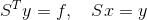

# num_methods
# First Lab
## Решение СЛАУ методом Гаусса
Ax = f. Дана матрица A с диагональным преобладанием, и вектор f. Найти x.
### Алгоритм решения
Представим А, как А = LU, где L - нижнетреугольная, U - верхнетреугольная матрица.  
Задача решается в два хода:  
- Прямой ход: привести матрицу к верхнетреугольному виду элементарными преобразованиеми строк.  
- Обратный ход: привести матрицу к диагональному виду элементарными преобразованиями строк.  
### Результаты  
Реализация метода Гаусса прошла 5 тестов с матрицами размерности от 100 до 500  
Также предоставлен график зависимости время выполнения программы от размерности матрицы:  

## Решение СЛАУ методом прогонки  
Ах = f. Дана матрица A, где А - трехдиагональная матрица с диагональным преобладанием, и вектор f. Найти x.
### Алгоритм решения  
Предположим, что неизвестные  связаны соотношением  
  
На прямом ходе прогонки находятся коэффициенты  , а на обратном неизвестные   
Где в итоге неизвестные  выражаются как  
, т.е.  

### Результаты
Реализация метода прогонки прошла 8 тестов с матрицами размерности от 100 до 800  
  
## Решение СЛАУ методом Холецкого
Ах = f. Дана матрица А, где А - симметричная матрица с диагональным преобладанием, и вектор f. Найти х.  
### Алгоритм решения  
Матрица А разлагается в произведение   , где S - верхняя треугольная матрица. Решение системы сводится к последовательному решению двух систем  
  

  

### Результаты  
Реализация метода Холецкого прошла 5 тестов с матрицами размерности от 100 до 500  

# Second Lab  
## Решение СЛАУ методом Зейделя  
Ax = f. Дана матрица А и вектор f. Найти х.  
### Алгоритм решения  
Каноническая форма:  
 
при   
  
  
  

### Результаты  
Реализация метода Зейделя прошла 5 тестов с матрицами размерности от 100 до 500  
  
## Решение СЛАУ методом Якоби  
Ax = f. Дана матрица А и вектор f. Найти х.  
### Алгоритм решения  
Каноническая форма:  
 
  
  
  

### Результаты  
Реализация метода Якоби прошла 2 теста (матрицы размерности 100 х 100 и 200 х 200), время выполнения во много раз превышало результаты по Зейделя:  
- 100 х 100 - 67 с.  
- 200 х 200 - 139 с.  
Также хочу приложить график зависимостей для методов Зейделя и Якоби  
  
# Third Lab  
## Линейная интерполяция  
Даны значения ! ! !.Необходимо построить построить линейную интерполяцию по парам (х, у) и применить на множестве Z.  
### Алгоритм решения  
!  
### Результаты  
!  
## Интерполяционный многочлен Лагранжа  
Даны значения ! ! !.Необходимо построить построить интерполяционный многочлен Лагранжа по парам (х, у) и применить на множестве Z.  
### Алгоритм решения  
!  
!  
### Результаты  
!  
## Сплайновая интерполяция  
Даны значения ! ! !.Необходимо построить построить сплайновую интерполяцию по парам (х, у) и применить на множестве Z. 
### Алгоритм решения  
!  
### Результаты  
!  
### Итоговый результат  
!
